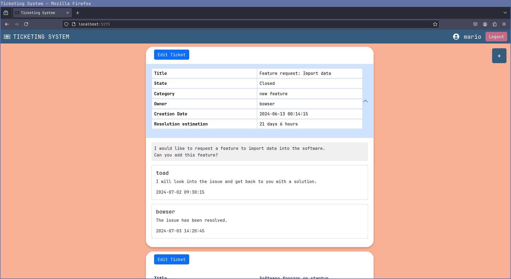
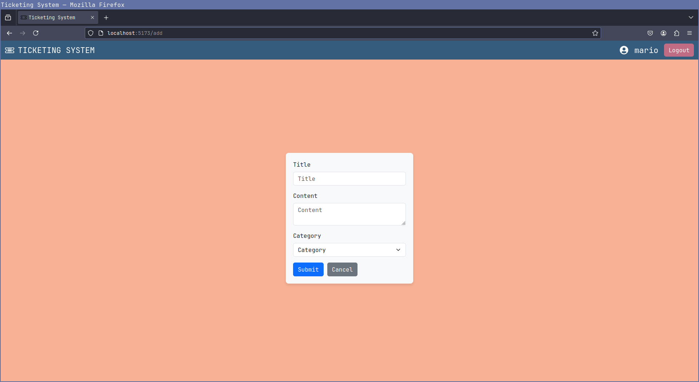

# Exam #1: "Ticketing System"
## Student: s323440   CIVITAREALE FEDERICO 

## React Client Application Routes

- Route `/`: homepage showing list of tickets
- Route `/login`: shows the login form
- Route `/add`: shows a form that allows to create a new ticket

## API Server

- GET `/tickets`
  - response body content: list of tickets with their content if admin, without content if not admin
- GET `/tickets/:id`
  - request parameters: id of the ticket
  - response body content: retrieve the single ticket information
- POST `/tickets`
  - request body content: ticket title, category and content
  - response body content: the created ticket
- POST `/tickets/:id`
  - request parameters: id of the ticket
  - request body content: new block of text to be added to the ticket
  - response body content: id of the newly created block
- PUT `/tickets/:id`
  - request parameters: id of the ticket
  - request body content: id, state and cateogry of the ticket to be modified
  - response body content: message of ticket succesfully modified
- POST `/sessions`
  - request body content: username and password of the user
  - response body content: id, username and admin boolean
- GET `/sessions/current`
  - response body content: id, username and admin boolean
- DELETE `/sessions/current`
  - response body content: message of succesful logout
- GET `/auth-token`
  - response body content: token (in a JSON object)

## API Server2

- POST `/stats`
  - request body content: title and category of a ticket
  - response body content: estimation (based on if the user is admin or not)

## Database Tables

- Table `users` - contains id, username, password, salt, admin
- Table `tickets` - contains id, state, category, owner, title, timestamp, content
- Table `blocks` - contains id, ticket_id, author, timestamp, content

## Main React Components

- `GenericLayout` (in `Layout.jsx`): default route, contains the navbar and the outlet to display every other component (index is TicketTable)
- `TicketTable` (in `Ticket.jsx`): starts the map for every ticket of the list
- `TicketRow` (in `Ticket.jsx`): displays an accordion for each ticket, its expansion contains the initial content and the ticket's relative blocks if the user is logged
- `LoginForm` (in `Authentication.jsx`): shows the login form
- `TicketForm` (in `AddTicket.jsx`): provides the form to create a new ticket

## Screenshot

## Users Credentials

- username: mario, password: password (admin)
- username: luigi, password: password
- username: peach, password: password
- username: toad, password: password (admin)
- username: yoshi, password: password
- username: bowser, password: password
